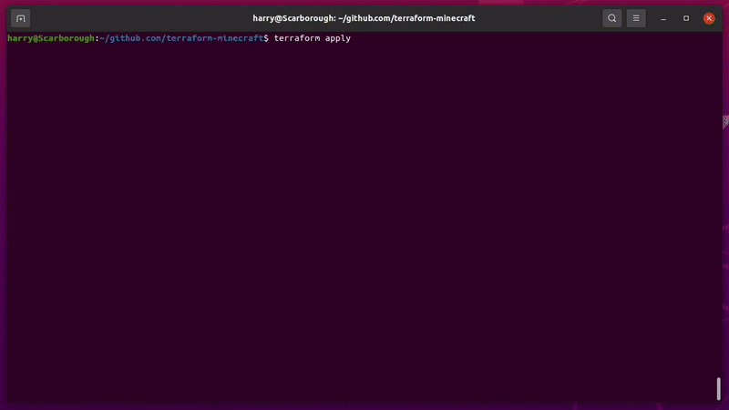

```
 _____                     __                               _                            __ _
/__   \___ _ __ _ __ __ _ / _| ___  _ __ _ __ ___     /\/\ (_)_ __   ___  ___ _ __ __ _ / _| |_
  / /\/ _ \ '__| '__/ _` | |_ / _ \| '__| '_ ` _ \   /    \| | '_ \ / _ \/ __| '__/ _` | |_| __|
 / / |  __/ |  | | | (_| |  _| (_) | |  | | | | | | / /\/\ \ | | | |  __/ (__| | | (_| |  _| |_
 \/   \___|_|  |_|  \__,_|_|  \___/|_|  |_| |_| |_| \/    \/_|_| |_|\___|\___|_|  \__,_|_|  \__|
```

## Description
Rather than spending hours following [the official guide](https://help.minecraft.net/hc/en-us/articles/360058525452-How-to-Setup-a-Minecraft-Java-Edition-Server) on how to set up a Minecraft server, you can run this simple script instead.



## Setup
- Generate an SSH key if you don't already have one with `ssh-keygen -t rsa -b 4096`.
- [Install Terraform](https://learn.hashicorp.com/tutorials/terraform/install-cli) (tested on 1.1.3).
- [Install the AWS CLI](https://docs.aws.amazon.com/cli/latest/userguide/install-cliv2.html).
- [Configure the AWS CLI with an access key ID and secret access key](https://docs.aws.amazon.com/cli/latest/userguide/cli-configure-quickstart.html).

## Variables

### `your_region`
- Where you want your server to be. The options are [here](https://docs.aws.amazon.com/AmazonRDS/latest/UserGuide/Concepts.RegionsAndAvailabilityZones.html).
- E.g. `eu-west-2`.

### `your_ip`
- Only this IP will be able to administer the server. Find it [here](https://www.whatsmyip.org/).
- E.g. `104.65.182.8`.

### `mojang_server_url`
- Copy the server download link from [here](https://www.minecraft.net/en-us/download/server/).
- E.g. `https://launcher.mojang.com/v1/objects/125e5adf40c659fd3bce3e66e67a16bb49ecc1b9/server.jar`.

### `your_public_key`
- This will be in `~/.ssh/id_rsa.pub` by default.
- E.g. `ssh-rsa AAAAB3NzaC1yc2EAAAADAQABAAACAQC5dzid+ZR1TGRmnWVbCnD5FAJG20bAGD0WvWrvqabWIZOwARZD9P7P0uArCWBAcdNusyv9RN9/wErT+P3kouJdPzqMoF1qJ08EgDq4qyRRgSG3SZIToNjndmxrRTJF09ybnT+AGMXonmZXk8I5Gx1x3OvM0GvdY9ZJNqGrOBAQDg7CBnY7TMpYNwQ5Brk17GGwGnuBDGJQzQKJ3lbk60GzGC6g6l/iBW7A8eUQhaZnKOnxj6d9TDk/2X1GOiPp3duNLtQKKqw6uDhglPk91lmnGr97pT9/Z+tSUrH+RVbVKdDbPDqMT28xIlZ0x5YR43Ypocvi065Z45yPsTUYcbq4I2ES0v56MU+ZmNuBYYvdHgaiPfF62ddoCkbs00YwjaGL8Nt8rAuOzGDGjnRWAbAcIF2DbE+K8a+lczkK7Ruzg2jXkjGOVvJIP/k9HFfWvybsmcU9thMDXkPBrjyB+Xxqzu/jn+DAjgBjIJS31RcD0noSGer60XwN21HdmUy+R6lSf3PAgFFX7y1NE3mKaattxJ8Eg/0vRf4AJJUTdlEqQlzjNqr0CWnwjcui/8Dt9DBlDjMeWB8kWngLu+y8TLFWkDdBjXsxgAcST630qw5aI2nYCQPEYBjBNJRiHdOJcxelHa8Tb9rSeYg+6eSE9bUBzhN7rKdIUwmAsSeOLcCFnw== alex@gmail.com`.

### `your_ami`
- Your instance AMI (different for every region). Use the default Amazon Linux one for your region. Find this https://docs.aws.amazon.com/AWSEC2/latest/UserGuide/finding-an-ami.html
- E.g. `ami-048e6f7223041530b`

## Steps
- Run `terraform init`.
- Run `terraform apply`.
- Copy the IP output by the previous command into Minecraft.
- Wait a minute for the server to spin up.
- Play.
- Irrecoverably shut everything down with `terraform destroy`.
